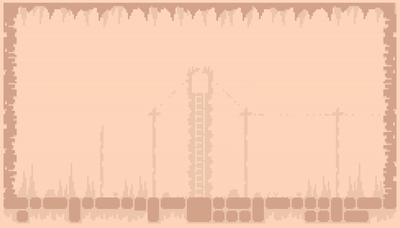

# Ball Up

- [Play Ball-Up](https://terrybrash.itch.io/ballup)
- [Watch the gameplay trailer](https://www.youtube.com/watch?v=B_lGbDb7apM)

2-player Co-Op action game about popping balls! Pop the balls matching your color and keep your friend alive through 10 levels of increasingly insane patterns of balls.

I spent every weekend over 2-3 months working on this and it's the first game I made after a decade-long break from gamedev. It's inspired by an old miniclip.com game I used to play called "Bubble Trouble" which I found out was inspired by an *even older* game called "Pang".

All of the code, graphics, and sounds were made entirely within the TIC-80 editor which was actually really fun to work with. Highly recommend!
